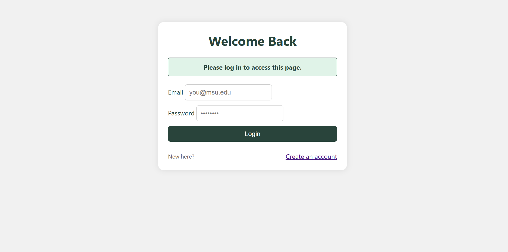
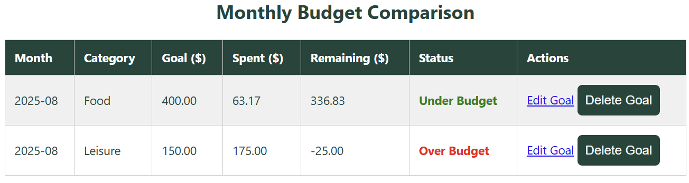
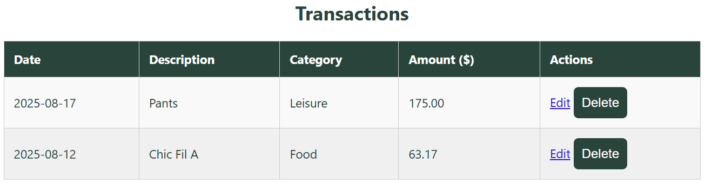
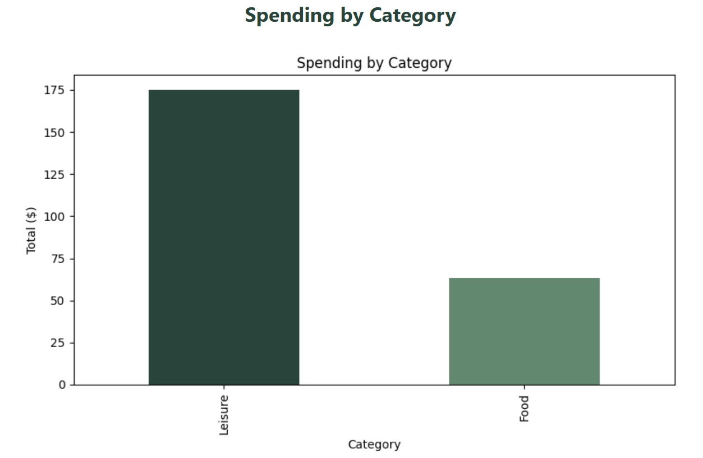
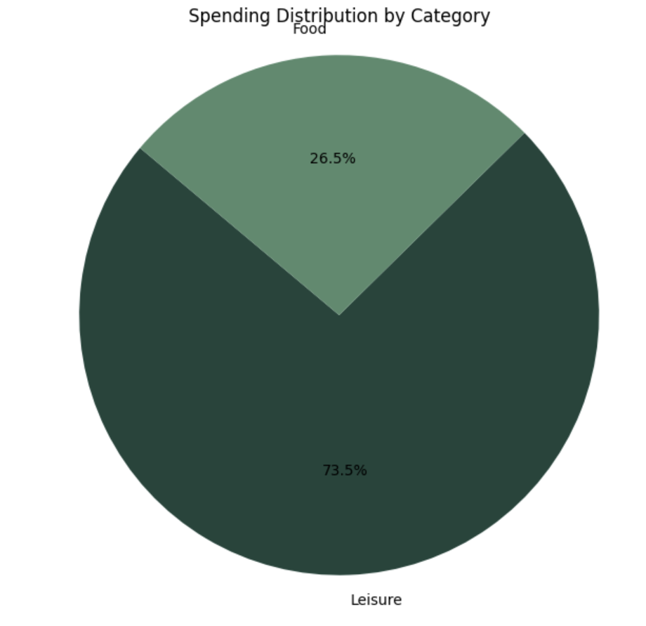

# MSU Expense Tracker

A Flask-based expense tracker application with multi-user support, CSV data storage, and interactive data visualizations. This project allows users to manage transactions, set monthly budget goals by category, and view spending insights through dynamic Matplotlib charts.

## Features
- **Multi-user authentication** for personalized data.
- **Add, edit, and delete transactions** with category, date, and description.
- **Set and edit spending goals** by month and category.
- **Budget status tracking** (under/over budget) with color-coded indicators.
- **Visualizations**: bar chart and pie chart for spending distribution.
- **Responsive design** for desktop and mobile.

## Tech Stack
- **Backend**: Python, Flask, Pandas
- **Frontend**: HTML, CSS (responsive design)
- **Charts**: Matplotlib
- **Data Storage**: CSV files

## Getting Started
1. Clone the repository:
```bash
git clone https://github.com/yourusername/flask-expense-tracker.git
cd flask-expense-tracker
```
2. Create a virtual environment and install dependencies:
```bash
python -m venv .venv
source .venv/bin/activate  # or .venv\Scripts\activate on Windows
pip install -r requirements.txt
```
3. Run the application:
```bash
flask run
```
4. Access it in your browser at `http://127.0.0.1:5000`.

## Screenshots






## License
This project is licensed under the MIT License.